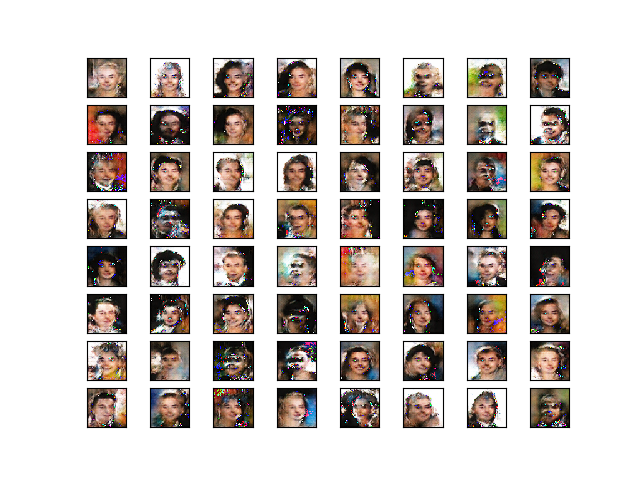

# DCGAN-CelebA-PyTorch-CPP

DCGAN Implementation (on CelebA dataset) using PyTorch C++ Frontend API (Libtorch)

- Training Code location: `src/main.cpp`
- Generator and Discriminator Definition: `include/network.hpp`
- Dataset Class: `include/dataset.hpp` and `src/dataset.cpp`
- Tested on Libtorch Version: Stable 1.4.0 (cxx11 ABI) with and without CUDA (10.1), Linux, OpenCV 4.1.0

How is this different from dcgan sample of PyTorch?

1. This loads a custom dataset (which is not in the dataset class of PyTorch) - CelebA.
2. Since some users prefer using Sequential Modules, so this example uses Sequential Module.

Utility Functions (to visualize images & create animation), and architecture is inherited from the PyTorch Example on DCGAN (https://github.com/pytorch/examples/blob/master/cpp/dcgan/).

Please note that this is in no way targeted to achieve a certain accuracy, but only focuses on creating an example template for DCGAN using Libtorch on CelebA Dataset.

## Steps to Follow

Note: This project requires OpenCV built from source. Make sure you also have Pillow (to save animation), NumPy, Matplotlib for running files in utils/ folder.

1. Create a build directory: `mkdir build/`
2. Change the directory path (absolute path) to `libtorch` in CMakeLists.txt file. Then configure using CMake: `cmake ..`
3. Create an output directory (in the build directory) to store the results & save checkpoints: `mkdir output/`
4. Build your project: `make`
5. Execute: `./bin/example/`
6. The saved checkpoints and outputs will be at `output/` directory
7. To visualize, go back to the main directory: `cd ../`
8. Execute: `python3 utils/display_samples.py`
9. The outputs will be stores in `build/output/output_images/` directory
10. If you want to make an animation, run: `python3 utils/visualize.py` and it will save the animation for you in `build/output/output_animation/` directory

## Blog

Find more about DCGAN on my blogs here: 

1. https://krshrimali.github.io/DCGAN-using-PyTorch-CPP/
2. https://krshrimali.github.io/DCGAN-using-PyTorch-CPP-Part-2/

## Results

This is the output from random noise (batch of) images after ~10 epochs of training:

Happy learning!

## TODOs

1. https://github.com/BuffetCodes/DCGAN-CelebA-PyTorch-CPP/issues/9
2. https://github.com/BuffetCodes/DCGAN-CelebA-PyTorch-CPP/issues/8
3. https://github.com/BuffetCodes/DCGAN-CelebA-PyTorch-CPP/issues/6

## Contribution

Note: _We believe, contributing to an open source project is the best way to learn. To help others learn, we decided to add `open source` label to the issues we think can be resolved by others. This will benefit us both._

If you are eager to contribute to this project, pick up an issue with <a href="https://github.com/BuffetCodes/DCGAN-CelebA-PyTorch-CPP/labels/open%20source">open source</a> label. Before you start working on it, make sure you create an issue and cc to any of the main contributors (@krshrimali / @HimanshuSinghGH), and let us know that you are interested. We do not want to waste your efforts in case someone else is already working on it. Thank you!
